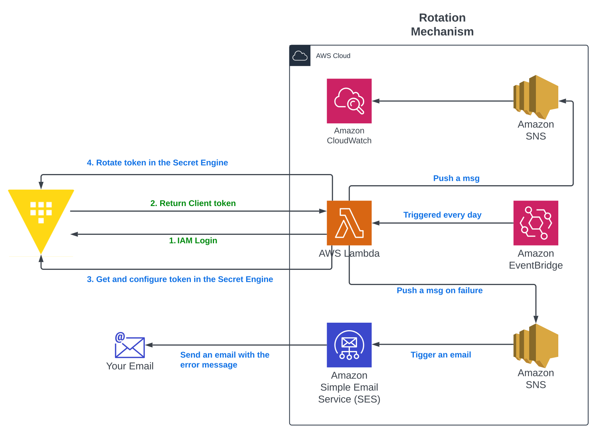

# terraform-aws-hcpvault

AWS Lambda Function to authenticate within Hashicorp Vault and rotate tokens in secret engines using the HCP Vault API.


## Overview

The purpose of this project is sharing a solution for who needs:
- Configure AWS Auth Method in HCP Vault
- Generate IAM user, role and policies to allow communication withing Vault and AWS
- Automate a rotation mechanism for tokens stored in secret engines

In this project you will find an example using terraform secret engine, and how to rotate the Terraform Cloud API Token.

> ⚠️ **Warning:**
> 
> Do NOT use it in production environments. This is a PoC, and it is NOT under the best practices related to security.


## Table of Contents

1. [Solution diagram](#solution_diagram)
2. [Purpose](#purpose)
3. [Use cases](#use_cases)
4. [Resources](#resources)
5. [Performance](#performance)
6. [Contributing](#contributing)
7. [Author](#author)


### Solution diagram




## Use cases

It can be taken for the following scenarios:
- Learning and practicing infrastructure as code, secret management, and cloud services using Terraform, HCP Vault and AWS.
- As proof of concept to secure secrets such as user credentials, database credentials, tokens, certificates, and so on.
- As a production solution for token rotation (please make sure customise it as needed under best security practices).


## Usage

### Prerequisites

1. Git SCM
    - Install on Windows: https://www.git-scm.com/download/win
    - Install on Linux: https://www.git-scm.com/download/linux
    - Install on MacO: Shttps://www.git-scm.com/download/mac

2. Terraform: https://developer.hashicorp.com/terraform/install 

3. Python 3.12: https://www.python.org/downloads/ 

4. AWS Account: https://aws.amazon.com/

5. AWS Access and Secret Key: https://docs.aws.amazon.com/IAM/latest/UserGuide/id_credentials_access-keys.html#Using_CreateAccessKey

6. Hashicorp Vault Server: https://developer.hashicorp.com/vault/tutorials/get-started-hcp-vault-dedicated/get-started-vault

7. Set up AWS auth method for HCP Vault: https://developer.hashicorp.com/vault/tutorials/manage-hcp-vault-dedicated/vault-auth-method-aws

8. AWS auth method detailed: https://developer.hashicorp.com/vault/docs/auth/aws 

### Steps

1. Set AWS access and secret key as environment variables

Windows
```bash
set AWS_ACCESS_KEY_ID=YOUR_ACCESS_KEY_ID
set AWS_SECRET_ACCESS_KEY=YOUR_SECRET_ACCESS_KEY
```

Linux
```bash
export AWS_ACCESS_KEY_ID="YOUR_ACCESS_KEY_ID"
export AWS_SECRET_ACCESS_KEY="YOUR_SECRET_ACCESS_KEY"
```

2. Clone the repository
```bash
git clone https://github.com/timossileandro/terraform-aws-hcpvault.git
```

3. Change directory
```bash
cd terraform-aws-hcpvault
```

4. Customise
    - variables.tf: change default values as needed.
    - check and modify configuration parameters in each resource as needed. 

5. Initialise terraform
```bash
terraform init
```

6. Validate terraform code
```bash
terraform validate
```

7. Run terraform plan and check it
```bash
terraform plan
```

8. Run terraform apply
```bash
terraform apply
```

⚠️ (Optional) If you are learning, practicing or just doing some testing
7. Do not forget to destroy the infrastructure to avoid being charge by AWS
```bash
terraform destroy
```

### Customisation

- Lambda Environment Variables:
    - VAULT_ADDR: HCP Vault Cluster URL.
    - VAULT_NAMESPACE: path of the namespace to be used (admin as default).
    - VAULT_AWS_ROLE: Role to login from the lambda function to Vault.
    - VAULT_TFC_ROLE (optional): for the example this will be the role used in the terraform secret engine. In case of using for other actions in another type of engine, change the terraform code and the value as needed.

- Lambda Trigger:
    - This solution uses EventBridge and it can be configured as frequent as needed.

- Lambda Destinations:
    - For failures and success is being used SNS, messages and CloudWatch metrics for success, and email address to notify failures.


## Performance

This solution has been tested using Terraform Cloud, Hashicorp Vault Dedicated and an AWS account. All platforms hosted in Sydney region.
The execution of the function has the following results:
- Memory: 85Mb
- Execution time: 7s


## Resources

| Name | Type |
|----------|----------|
[terraform-aws-modules](https://registry.terraform.io/modules/terraform-aws-modules/lambda/aws/latest) | module |
[aws_cloudwatch_event_rule](https://registry.terraform.io/providers/hashicorp/aws/latest/docs/resources/cloudwatch_event_rule) | resource |
[aws_cloudwatch_event_target](https://registry.terraform.io/providers/hashicorp/aws/latest/docs/resources/cloudwatch_event_target) | resource |
[aws_lambda_permission](https://registry.terraform.io/providers/hashicorp/aws/latest/docs/resources/lambda_permission) | resource |
[aws_iam_user](https://registry.terraform.io/providers/hashicorp/aws/latest/docs/resources/iam_user) | resource |
[aws_iam_user_policy](https://registry.terraform.io/providers/hashicorp/aws/latest/docs/resources/iam_user_policy) | resource |
[aws_iam_role](https://registry.terraform.io/providers/hashicorp/aws/latest/docs/resources/iam_role) | resource |
[aws_iam_policy](https://registry.terraform.io/providers/hashicorp/aws/latest/docs/resources/iam_policy) | resource |
[aws_iam_role_policy_attachment](https://registry.terraform.io/providers/hashicorp/aws/latest/docs/resources/iam_role_policy_attachment) | resource |
[aws_sns_topic](https://registry.terraform.io/providers/hashicorp/aws/latest/docs/resources/sns_topic) | resource |
[aws_sns_topic_subscription](https://registry.terraform.io/providers/hashicorp/aws/latest/docs/resources/sns_topic_subscription) | resource |


## Contributing

You are welcome to contribute! If you are interested in discussing or giving your point of view please reach me out on LinkedIn 😃


## Author

- **Leandro Timossi** - [leandrotimossi](https://github.com/timossileandro)


